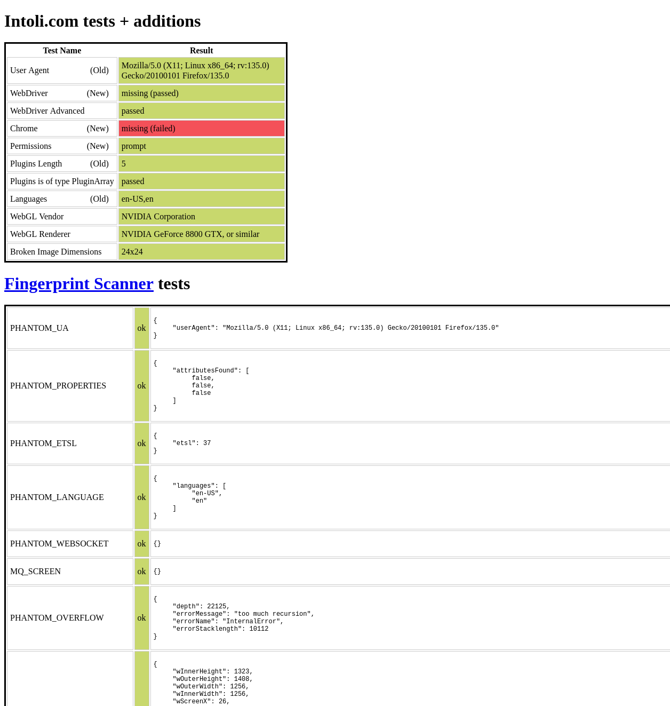
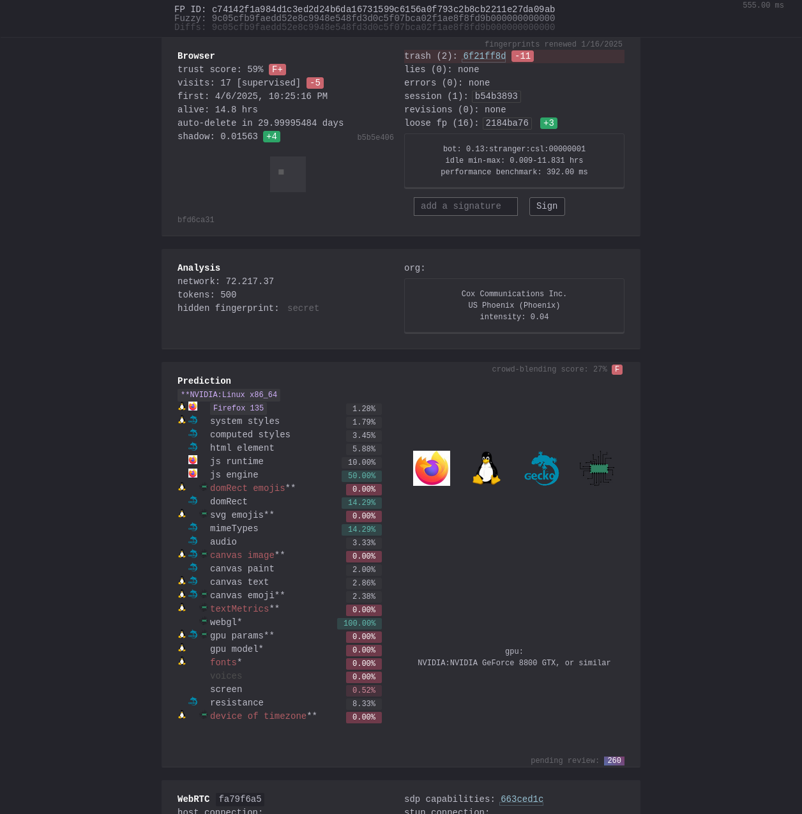

# Undetected GeckoDriver

A radiation-hardened Firefox WebDriver bypass tool developed in accordance with JPL-STD-RUST-001 Rev A.

## Architecture Overview


*Figure 1: System architecture showing the binary patching workflow*

## Overview

This tool patches Firefox's `libxul.so` binary to bypass WebDriver detection mechanisms, allowing for automated browser testing without being detected as automation. It's implemented using memory-safe, radiation-hardened patterns suitable for mission-critical applications.

## Features

- **Zero Unsafe Code**: Full memory-safe implementation with no `unsafe` blocks
- **Radiation Hardening**: Triple Modular Redundancy (TMR) voting mechanisms to protect against Single Event Upsets (SEUs)
- **Bounded Operations**: All loops have statically verifiable upper bounds
- **Resource Constraints**: Fixed memory allocation with predetermined limits
- **Fault Containment**: Comprehensive error handling with recovery mechanisms
- **Temporal Predictability**: All operations have deterministic execution paths

## Proof of Effectiveness

The following screenshots demonstrate successful bypass of automation detection:

### SannySoft Detection Test

*Figure 2: SannySoft detection bypass*

### CreepJS Detection Test

*Figure 3: CreepJS detection bypass*

## Installation

```bash
# Clone the repository
git clone https://github.com/coleleavitt/undetected_geckodriver.git
cd undetected_geckodriver

# Verify all prerequisites are installed
make check-prereqs

# Build the project with radiation-hardened configurations
make build

# For JPL-compliant enhanced hardening
make jpl-build
```

## Usage

```bash
# Patch Firefox's libxul.so to bypass WebDriver detection
undetected_geckodriver /opt/firefox/libxul.so

# Run automated tests with the patched Firefox
make test
```

### Recommended Firefox Preferences

For optimal undetectability, add these preferences to your Firefox profile:

```javascript
user_pref("dom.webdriver.enabled", false);
user_pref("devtools.selfxss.count", 0);
user_pref("marionette.enabled", false);
user_pref("remote.enabled", false);
user_pref("remote.log.level", "Fatal");
user_pref("remote.force-local", true);
```

## Development & Verification

### Build Targets
- `make build`: Standard radiation-hardened build
- `make jpl-build`: Enhanced JPL-compliant release build with additional hardening
- `make test`: Run tests with radiation hardening enabled
- `make clean`: Remove build artifacts and coverage data

### Verification Targets
- `make check`: Run all verification checks
- `make jpl-verify`: Run all JPL-specific verification checks
- `make static-analysis`: Run Clippy for code analysis
- `make static-bounds-check`: Verify all loops have static bounds
- `make memory-safety-check`: Verify memory safety patterns
- `make tmr-check`: Verify Triple Modular Redundancy patterns
- `make formal-verify`: Run formal verification tools if available
- `make radiation-hardening`: Verify radiation hardening patterns

### Documentation & Reports
- `make jpl-docs`: Generate JPL-compliant documentation
- `make verification-report`: Generate comprehensive verification report
- `make coverage`: Generate code coverage report

### Dependency Management
- `make dependency-verify`: Verify dependency supply chain security
- `make lock-dependencies`: Lock dependencies for reproducible builds

## Implementation Details

### Radiation Hardening Techniques

This implementation follows JPL-STD-RUST-001 Rev A guidelines for radiation-hardened software:

1. **Triple Modular Redundancy (TMR)**: Critical operations use the `tmr_vote!` macro for fault tolerance:
   ```rust
   // Majority voting mechanism for fault tolerance
   tmr_vote!(1, 1, 0)  // Returns 1 (majority vote)
   tmr_vote!(0, 0, 1)  // Returns 0 (majority vote)
   ```

2. **SEU (Single Event Upset) Resistance**: Pattern replacements use Hamming-encoded data to ensure data integrity

3. **Memory Protection**: Barrier patterns and safety margins detect memory corruption

4. **Pattern Validation**: All pattern replacements have size limits enforced by `MAX_PATTERN_LENGTH`

### System Architecture

The implementation follows a modular architecture with radiation-hardened traits:

- `BinaryLoader`: Manages ELF binary loading with memory safety checks
- `PatternDetector`: Identifies WebDriver-related string patterns
- `PatternReplacer`: Applies radiation-hardened replacements
- `FileOperations`: Handles file I/O with validation
- `SystemOperations`: Provides system-level functions for process management

## Testing

The test suite verifies:

1. TMR voting mechanisms
2. Pattern replacement constraints
3. Firefox binary patching
4. Automated WebDriver detection bypass on test sites

Run tests with:

```bash
make test
```

Generate coverage reports with:

```bash
make coverage
```

## JPL Compliance

This project adheres to all LOC-1 through LOC-4 compliance levels from the JPL Institutional Coding Standard:

- **LOC-1 Language Compliance**: No undefined or implementation-defined behavior
- **LOC-2 Predictable Execution**: Bounded loops, no recursion, static memory allocation
- **LOC-3 Defensive Coding**: Verification of inputs, defensive checks throughout
- **LOC-4 Code Clarity**: Limited preprocessor use, small functions with clear purpose

## Safety Considerations

This tool requires root/administrator privileges to modify Firefox system files. Always backup your Firefox installation before using. The tool automatically creates backups before modifying any files.

## License

MIT

## Acknowledgments

Developed in accordance with JPL Institutional Coding Standards for safety-critical systems.